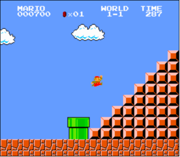
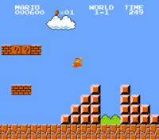

# Problems to Solve

### 1 - Mario ascend right aligned pyramid

Toward the end of World 1-1 in Nintendo’s Super Mario Bros., Mario must ascend right-aligned pyramid of bricks, as in the below.



In a file called mario.c in a folder called mario-less, implement a program in C that recreates that pyramid, using hashes (#) for bricks, as in the below:
```

       #
      ##
     ###
    ####
   #####
  ######
 #######
########

```
But prompt the user for an int for the pyramid’s actual height, so that the program can also output shorter pyramids like the below:

```
  #
 ##
###

```
Re-prompt the user, again and again as needed, if their input is not greater than 0 or not an int altogether.

### How to Test

Does your code work as prescribed when you input:

- -1 or other negative numbers?
- 0?
- 1 or other positive numbers?
- letters or words?
- no input at all, when you only hit Enter?

---

### 2 - Mario adjacent pyramids

Toward the beginning of World 1-1 in Nintendo’s Super Mario Brothers, Mario must hop over adjacent pyramids of blocks, per the below.



In a file called mario.c in a folder called mario-more, implement a program in C that recreates that pyramid, using hashes (#) for bricks, as in the below:

```  
   #  #
  ##  ##
 ###  ###
####  ####
```

And let’s allow the user to decide just how tall the pyramids should be by first prompting them for a positive int between, say, 1 and 8, inclusive.
Examples

Here’s how the program might work if the user inputs 8 when prompted:
```
$ ./mario
Height: 8
       #  #
      ##  ##
     ###  ###
    ####  ####
   #####  #####
  ######  ######
 #######  #######
########  ########
```
Here’s how the program might work if the user inputs 4 when prompted:
```
$ ./mario
Height: 4
   #  #
  ##  ##
 ###  ###
####  ####
```
Here’s how the program might work if the user inputs 2 when prompted:
```
$ ./mario
Height: 2
 #  #
##  ##
```
And here’s how the program might work if the user inputs 1 when prompted:
```
$ ./mario
Height: 1
#  #
``` 

If the user doesn’t, in fact, input a positive integer between 1 and 8, inclusive, when prompted, the program should re-prompt the user until they cooperate:
```
$ ./mario
Height: -1
Height: 0
Height: 42
Height: 50
Height: 4
   #  #
  ##  ##
 ###  ###
####  ####
```
Notice that width of the “gap” between adjacent pyramids is equal to the width of two hashes, irrespective of the pyramids’ heights.

### How to Test Your Code

Does your code work as prescribed when you input:

- 1 (or other negative numbers)?
- 0?
- 1 through 8?
- 9 or other positive numbers?
- letters or words?
- no input at all, when you only hit Enter?

---