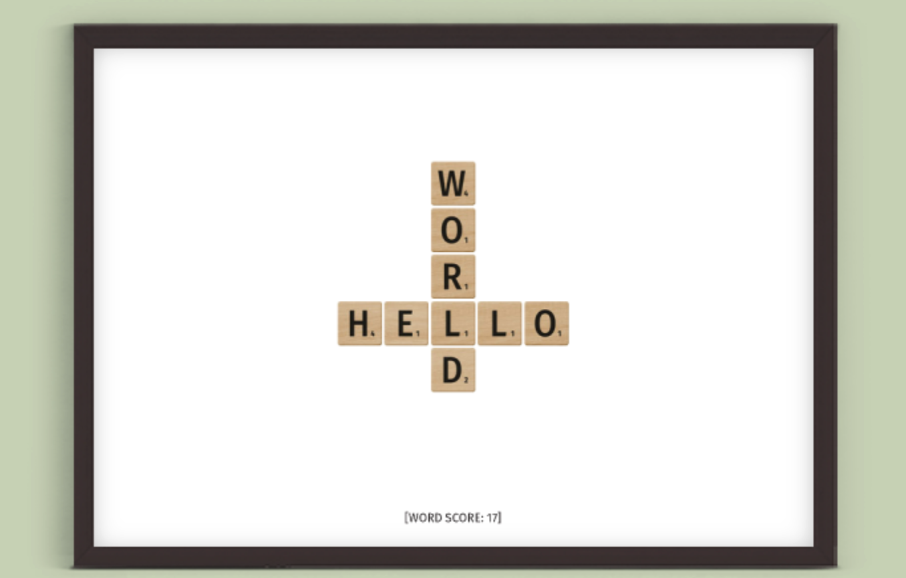
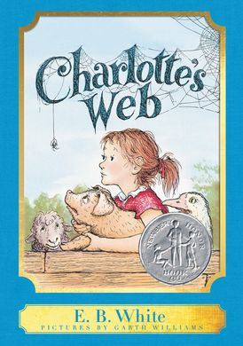
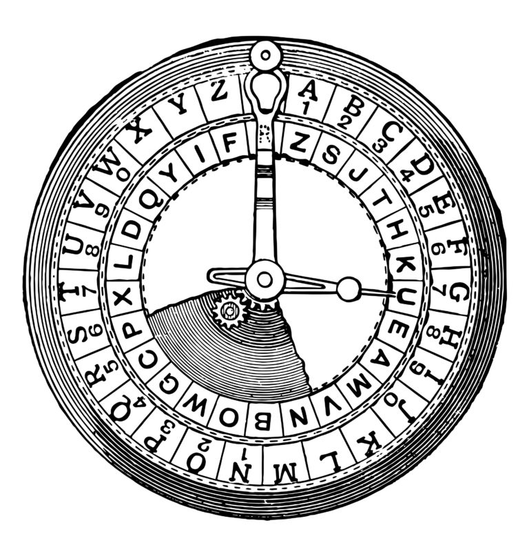

# Problem set 2

## Scrabble



Problem to Solve

In the game of Scrabble, players create words to score points, and the number of points is the sum of the point values of each letter in the word.
| Letra | Pontos | | Letra | Pontos | | Letra | Pontos |
|:---:|:---:|---|:---:|:---:|---|:---:|:---:|
| **A** | 1 | | **J** | 8 | | **S** | 1 |
| **B** | 3 | | **K** | 5 | | **T** | 1 |
| **C** | 3 | | **L** | 1 | | **U** | 1 |
| **D** | 2 | | **M** | 3 | | **V** | 4 |
| **E** | 1 | | **N** | 1 | | **W** | 4 |
| **F** | 4 | | **O** | 1 | | **X** | 8 |
| **G** | 2 | | **P** | 3 | | **Y** | 4 |
| **H** | 4 | | **Q** | 10 | | **Z** | 10 |
| **I** | 1 | | **R** | 1 | | | |

For example, if we wanted to score the word “CODE”, we would note that the ‘C’ is worth 3 points, the ‘O’ is worth 1 point, the ‘D’ is worth 2 points, and the ‘E’ is worth 1 point. Summing these, we get that “CODE” is worth 7 points.

In a file called scrabble.c in a folder called scrabble, implement a program in C that determines the winner of a short Scrabble-like game. Your program should prompt for input twice: once for “Player 1” to input their word and once for “Player 2” to input their word. Then, depending on which player scores the most points, your program should either print “Player 1 wins!”, “Player 2 wins!”, or “Tie!” (in the event the two players score equal points).

## How to Test

Your program should behave per the examples below.
```
$ ./scrabble
Player 1: Question?
Player 2: Question!
Tie!

$ ./scrabble
Player 1: red
Player 2: wheelbarrow
Player 2 wins!

$ ./scrabble
Player 1: COMPUTER
Player 2: science
Player 1 wins!

$ ./scrabble
Player 1: Scrabble
Player 2: wiNNeR
Player 1 wins!
```

---

## Readability



Problem to Solve

According to Scholastic, E.B. White’s Charlotte’s Web is between a second- and fourth-grade reading level, and Lois Lowry’s The Giver is between an eighth- and twelfth-grade reading level. What does it mean, though, for a book to be at a particular reading level?

Well, in many cases, a human expert might read a book and make a decision on the grade (i.e., year in school) for which they think the book is most appropriate. But an algorithm could likely figure that out too!

In a file called readability.c in a folder called readability, you’ll implement a program that calculates the approximate grade level needed to comprehend some text. Your program should print as output “Grade X” where “X” is the grade level computed, rounded to the nearest integer. If the grade level is 16 or higher (equivalent to or greater than a senior undergraduate reading level), your program should output “Grade 16+” instead of giving the exact index number. If the grade level is less than 1, your program should output “Before Grade 1”.

So what sorts of traits are characteristic of higher reading levels? Well, longer words probably correlate with higher reading levels. Likewise, longer sentences probably correlate with higher reading levels, too.

A number of “readability tests” have been developed over the years that define formulas for computing the reading level of a text. One such readability test is the Coleman-Liau index. The Coleman-Liau index of a text is designed to output that (U.S.) grade level that is needed to understand some text. The formula is

index = 0.0588 * L - 0.296 * S - 15.8

where L is the average number of letters per 100 words in the text, and S is the average number of sentences per 100 words in the text.

## How to Test

Try running your program on the following texts, to ensure you see the specified grade level. Be sure to copy only the text, no extra spaces.

```

- One fish. Two fish. Red fish. Blue fish. (Before Grade 1)
Would you like them here or there? I would not like them here or there. I would not like them anywhere. (Grade 2)

- Congratulations! Today is your day. You're off to Great Places! You're off and away! (Grade 3)

- Harry Potter was a highly unusual boy in many ways. For one thing, he hated the summer holidays more than any other time of year. For another, he really wanted to do his homework, but was forced to do it in secret, in the dead of the night. And he also happened to be a wizard. (Grade 5)

- In my younger and more vulnerable years my father gave me some advice that I've been turning over in my mind ever since. (Grade 7)

- Alice was beginning to get very tired of sitting by her sister on the bank, and of having nothing to do: once or twice she had peeped into the book her sister was reading, but it had no pictures or conversations in it, "and what is the use of a book," thought Alice "without pictures or conversation?" (Grade 8)

- When he was nearly thirteen, my brother Jem got his arm badly broken at the elbow. When it healed, and Jem's fears of never being able to play football were assuaged, he was seldom self-conscious about his injury. His left arm was somewhat shorter than his right; when he stood or walked, the back of his hand was at right angles to his body, his thumb parallel to his thigh. (Grade 8)

- There are more things in Heaven and Earth, Horatio, than are dreamt of in your philosophy. (Grade 9)

- It was a bright cold day in April, and the clocks were striking thirteen. Winston Smith, his chin nuzzled into his breast in an effort to escape the vile wind, slipped quickly through the glass doors of Victory Mansions, though not quickly enough to prevent a swirl of gritty dust from entering along with him. (Grade 10)

- A large class of computational problems involve the determination of properties of graphs, digraphs, integers, arrays of integers, finite families of finite sets, boolean formulas and elements of other countable domains. (Grade 16+)

```

---

## Caesar

 

 Problem to Solve

Supposedly, Caesar (yes, that Caesar) used to “encrypt” (i.e., conceal in a reversible way) confidential messages by shifting each letter therein by some number of places. For instance, he might write A as B, B as C, C as D, …, and, wrapping around alphabetically, Z as A. And so, to say HELLO to someone, Caesar might write IFMMP instead. Upon receiving such messages from Caesar, recipients would have to “decrypt” them by shifting letters in the opposite direction by the same number of places.

The secrecy of this “cryptosystem” relied on only Caesar and the recipients knowing a secret, the number of places by which Caesar had shifted his letters (e.g., 1). Not particularly secure by modern standards, but, hey, if you’re perhaps the first in the world to do it, pretty secure!

Unencrypted text is generally called plaintext. Encrypted text is generally called ciphertext. And the secret used is called a key.

To be clear, then, here’s how encrypting HELLO with a key of 1
yields IFMMP:

```
plaintext:  H   E   L   L   O
key:    	1	1	1	1	1
ciphertext:	I	F	M	M	P
```

More formally, Caesar’s algorithm (i.e., cipher) encrypts messages by “rotating”each letter by `𝑘`positions. 
More formally, if `𝑝`is some plaintext (i.e., an unencrypted message), `𝑝𝑖` is the `𝑖𝑡⁢ℎ` character in `𝑝`, and `𝑘`is a secret key (i.e., a non-negative integer), then each letter, `𝑐𝑖`, in the ciphertext, `𝑐`, is computed as `𝑐𝑖=(𝑝𝑖+𝑘)⁢ % ⁢26`

wherein % ⁢26 here means “remainder when dividing by 26.” This formula perhaps makes the cipher seem more complicated than it is, but it’s really just a concise way of expressing the algorithm precisely. Indeed, for the sake of discussion, think of A (or a) as 0, B (or b) as 1, …, H (or h) as 7, I (or i) as 8, …, and Z (or z) as 25. Suppose that Caesar just wants to say Hi to someone confidentially using, this time, a key, `𝑘`, of 3. And so his plaintext, `𝑝`, is Hi, in which case his plaintext’s first character, `𝑝0`, is H (aka 7), and his plaintext’s second character, `𝑝1`, is i (aka 8). His ciphertext’s first character, `𝑐0`, is thus K, and his ciphertext’s second character, `𝑐1`, is thus L.

In a file called caesar.c in a folder called caesar, write a program that enables you to encrypt messages using Caesar’s cipher. At the time the user executes the program, they should decide, by providing a command-line argument, what the key should be in the secret message they’ll provide at runtime. We shouldn’t necessarily assume that the user’s key is going to be a number; though you may assume that, if it is a number, it will be a positive integer.

## Substitution
### Problem to solve

In a substitution cipher, we “encrypt” (i.e., conceal in a reversible way) a message by replacing every letter with another letter. To do so, we use a key: in this case, a mapping of each of the letters of the alphabet to the letter it should correspond to when we encrypt it. To “decrypt” the message, the receiver of the message would need to know the key, so that they can reverse the process: translating the encrypt text (generally called ciphertext) back into the original message (generally called plaintext).

A key, for example, might be the string NQXPOMAFTRHLZGECYJIUWSKDVB. This 26-character key means that A (the first letter of the alphabet) should be converted into N (the first character of the key), B (the second letter of the alphabet) should be converted into Q (the second character of the key), and so forth.

A message like HELLO, then, would be encrypted as FOLLE, replacing each of the letters according to the mapping determined by the key.

In a file called substitution.c in a folder called substitution, create a program that enables you to encrypt messages using a substitution cipher. At the time the user executes the program, they should decide, by providing a command-line argument, on what the key should be in the secret message they’ll provide at runtime.

## Specification

Design and implement a program, substitution, that encrypts messages using a substitution cipher.

- Implement your program in a file called substitution.c in a directory called substitution.
- Your program must accept a single command-line argument, the key to use for the substitution. The key itself should be case-insensitive, so whether any character in the key is uppercase or lowercase should not affect the behavior of your program.
- If your program is executed without any command-line arguments or with more than one command-line argument, your program should print an error message of your choice (with printf) and return from main a value of 1 (which tends to signify an error) immediately.
- If the key is invalid (as by not containing 26 characters, containing any character that is not an alphabetic character, or not containing each letter exactly once), your program should print an error message of your choice (with printf) and return from main a value of 1 immediately.
- Your program must output plaintext: (without a newline) and then prompt the user for a string of plaintext (using get_string).
- Your program must output ciphertext: (without a newline) followed by the plaintext’s corresponding ciphertext, with each alphabetical character in the plaintext substituted for the corresponding character in the ciphertext; non-alphabetical characters should be outputted unchanged.
- Your program must preserve case: capitalized letters must remain capitalized letters; lowercase letters must remain lowercase letters.
- After outputting ciphertext, you should print a newline. Your program should then exit by returning 0 from main.

You might find one or more functions declared in ctype.h to be helpful, per manual.cs50.io.